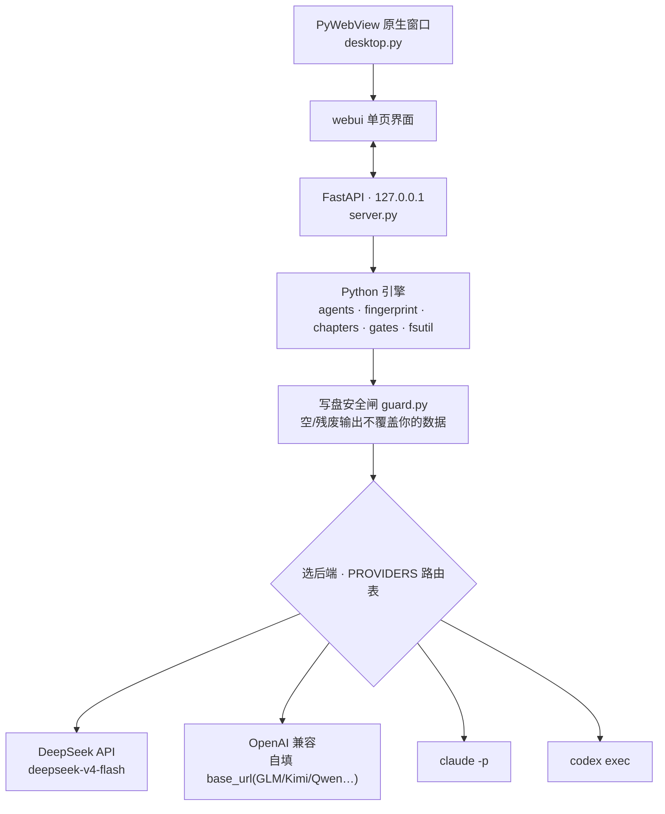

<div align="center">

<picture>
  <source media="(prefers-color-scheme: dark)" srcset="docs/design/loom-logo-dark.png" />
  
</picture>

# loom · 织布机

**把一队分工 Agent 织成一条写小说的流水线**,做成桌面客户端(Mac / Windows)。<br/>
读着你的「外置大脑」,一键跑出一章正文;你手改,它**越写越像你**。

[](LICENSE)
[](https://github.com/WadeZhao23/loom-novel/releases/latest)


[⬇ 下载最新版](https://github.com/WadeZhao23/loom-novel/releases/latest) · [它是什么](#它是什么) · [跑起来](#跑起来) · [隐私](#隐私--数据去向)

</div>

---

> 后端可插拔,九选一:**DeepSeek(默认)/ 智谱 GLM / Moonshot Kimi / 通义 Qwen / 豆包(火山方舟)/ 硅基流动**(国产直连、不用梯子、各家自带 key)/ **Claude Code / Codex**(复用本机客户端登录、免 key)/ **OpenAI 兼容(自填 base_url)**。设置里一键切换 + 检测连接;模型**可下拉可手填** + 「拉取可用模型」实时列真实型号(名字怎么变都不过时);DeepSeek 默认 `deepseek-v4-pro`。

## 它是什么

- **外置大脑**(每本书独有、会变):世界观 / 人物卡 / 卡章纲 / **写作指纹** / 违禁词。
- **skills**(跨书复用、不变):网文大神 / 去AI味 / 故事引擎 / 黄金开篇 / 评估自检 / 世界观引擎 / 金手指 / 拆书,外加 **37 个题材速查**(新建时按题材只拷一份给设定师)。
- **agents**(5 道工序):设定师 → 大纲师 → 写手 → 编辑 → 润色师。每个顶部 YAML 声明它读哪些文件。

### 一章,是这样织出来的


5 个 agent 顺序跑,累积一个「本章工作区」,每步读到目前为止的全部产物;写第 N 章还会读你手改后的第 N-1 章做衔接。

### 流水线上的五个人

|  |  |  |
|:--:|:--:|:--:|
|  |  |  |
| **设定师** · 立规矩 | **大纲师** · 搭骨架 | **写手** · 落字 |
| 守世界观,钉死硬约束 | 拆 3–6 场分镜,标爆点 | 照你的写作指纹落字 |
|  |  |  |
| **编辑** · 挑硬伤 | **润色师** · 去AI味 |  |
| 盘爽点/钩子/OOC,当场改 | 擦机器腔,留你的口头禅 |  |

### 两条核心理念

- **写作指纹 = 像你**。写手/润色师照它写;你点「学这章的手改」,它把**你的改动**蒸馏进指纹,越写越像你。指纹只学你的改动,绝不学 AI 自己的输出。
- **去AI味 = 独立功能**,只擦通用机器味、让文字像真人——不针对任何检测器作弊。


### 3.2.0

冲着「打开就顺手」去的一版:进门不再输路径 · 书架像书架 · 字数听话 · 外置大脑目录化。老书零迁移。

- **进门就顺**:打开直接回上一本书;新建/导入/样例统一进「我的书架」;导入用系统文件夹选择器;模型和 key 记在用户级、新书自动继承(key 不进书文件夹,分享书稿不漏 key);欢迎页拆成 接入模型 → 我的书架 → 开一本书 三板块。
- **书架像书架**:一排立着的书脊、竖排楷体书名;挪走的书标「失踪」,点 × 移出不删文件。
- **字数听话**:大纲师按目标字数定场次(2000 字约拆 3 场),写手写满即收,编辑/润色只精炼不扩写——按字数计费直接省钱。
- **外置大脑目录化**(新书默认,老书单文件行为一字不变):世界观一节一文件、人物一人一卡(文件名即专名);learn 的 AI 补充单独进「成长档案.md」,永不碰你手写的文件;「冰山真相」按文件名挡住不喂写手。
- **左栏四类目**:正文 / 设定(外置大脑)/ 脉络(原「书房」)/ 你的声音;幕后折叠、导出备份进设置;桌面图标水墨化。

### 3.1.0

一次从里到外的重做:换一身「纸墨」皮 · 交互全面简化 · 多接一批模型 · 长篇写着更稳。

**看得见的**
- **全新「纸墨」视觉**:宣纸底 + 墨分五色 + 一枚印泥朱(你的痕迹:指纹/手改/学到的),明暗双主题(夜里是墨池不是深黑);五位工序角色换成水墨白描头像;品牌时刻用楷体。
- **写作台不再挤**:后端配置收进「设置」,顶栏只剩正事;打字时侧栏自动淡出,让纸面当主角;选中正文就地浮出「重写这段」;`⌘K` 命令面板收录一切操作。
- **写章能后台织**:写章弹窗可「收起」,底部留一条状态条边写边读改别的章;`learn` 完成盖一枚朱印,一眼看清「学进 N 条 / 拆掉 M 条」。
- **脉络三视图**(全书的只读投影,长篇不再靠脑子记):**时间轴**(故事到哪了,点击跳章)· **伏笔账本**(埋了哪些、还了没、哪条悬空)· **专名册**(境界/地名/人名,就是写手照抄的那份)。
- **起步旅程**:新书侧栏一张「起步 · N/4」卡,接入模型 → 喂样本 → 织第一章 → 手改 learn,做完自动消失。

**多接的模型**
- 智谱 GLM / Moonshot Kimi / 通义 Qwen / 豆包(火山方舟)/ 硅基流动 升为**一等预设**(锁好接口地址、各家 key 各存各的、点「拉取可用模型」现选型号);DeepSeek 仍是默认,Claude/Codex 免 key 通道保留。

**长篇写着更稳(引擎重构 S1–S7,你不用管细节)**
- **续跑不再乱烧钱**:改设定/改提示词/改字数才精准重算该重跑的工序;新增一个 skills 文件、编辑器动了个末尾空行,不再误触发整章全量重跑。老书升级当天**零额外计费**(账本原地升级、不重跑)。
- **30+ 章不撑爆**:远章的 AI 回顾/补充自动折叠、被改稿取代的旧稿不再重复喂给模型;写作指纹的学习不再有隐形字数天花板,不会把你攒的 anchor 例句挤掉。
- **更抗手滑**:自动保存撞上 learn 落盘的并发写盘缺陷已修(不再偶发「保存失败」);删/插/移章时嵌入式记忆块的章号跟着重排。
- 引擎全程 golden 快照护栏(prompt/事件/落盘逐字节钉死)+ CI 每次改动自动跑测试与回归门禁,重构不改任何写作行为。

### 3.0.2 修复

- **修「章节字数失控」**(用户实报:目标 2400 字、实出 6000+):根因是目标字数只用来算 token 预算和最短校验,**从未写进提示词**——模型根本不知道你要 2400 字;而 token 预算又为思考型模型刻意放宽(防 2.0.1 的空响应),等于零约束自由发挥。现在把字数作为**软指令**写进各工序任务行(写手「约 N 字、写到就收章、不注水」;编辑/润色师「保持篇幅、只改不扩写」),终稿超目标 1.5 倍再**留痕提醒**可能注水——纯提示不阻断,也**不**调小 token 预算(那会拦腰斩章 + 复发空响应)。对按字计费的 DeepSeek 用户直接省钱。

### 3.0.1 修复

一轮代码审计后的确定性加固,纯本地、不改「像你/去AI味」的判定口径:

- **修对白句被切碎**:分句时把句末的收尾引号(`"』』`)并进本句——`他说:"好的。"然后离开。` 不再被切成两个残句,对白密集章的 `learn` 信号更干净。
- **堵一处剧透泄漏**:反转/真相小节写在 `#### 深层标题` 里时,原先只挡 `###`、会被逐字漏给写手;现在按标题层级追踪,`###`~`######` 的反转子块连同其子孙一并剔除。
- **硬设定识别更稳**:世界观把「力量体系/境界/地名势力」写成 `### 三级标题`、或整份没用 `##` 时也能识别(三层回退);一节都没命中会**提示检查标题写法**,不再静默失去逐字保护。
- **联网调用加超时**:OpenAI 兼容后端显式设超时(连接 10s / 一般 120s / 流式思考期放宽到 300s),坏网络下不再干等十分钟才报错。
- **防并发写坏一章**:写章 / learn / seed 等落盘端点加**每本书的写锁**,双击或并发请求会友好提示「本书正在写作中」,不再同写一章导致账本损坏。
- **去AI味豁免收紧**:anchor 例句豁免改回单向匹配,一条短签名句不再放跑所有含它的机器腔整句;违禁词自检**单字不再误报**(「颤抖」不踩「抖」)并附上下文;`.env`(存 key)权限收到仅属主可读写(`0600`)。
- **首个「越写越像你」的可回归度量**:离线评测框架(`evals/`,开发用)新增文风相似度对比 + 「中性指纹 vs 学过指纹」A/B 实验——纯字符串统计、不发网、绝不进产品界面(守 ADR 0002),让核心承诺第一次有可证伪的数字。

### 3.0.0

三条新通道:立项卡定位 · 文风参考入写手 · 播种可用别人的范文

- 新增可选外置大脑「立项卡」(平台/分区/题材/对标意图/为什么选它,各格可空、留空照常出稿):整卡喂设定师当定位背景;平台字段给违禁词自检定基线松紧,粗粒度严/默认二档、缺卡不阻断。人手维护,loom 从不自动写。
- 新增可选外置大脑「文风参考」:贴别人的原文范文当风格样例,每章进写手当佐料。两阀一栏兜底——指纹永远压范文、只学节奏措辞句式、严禁搬专名整句(镜像拆书黑名单),且绝不进 learn:开局像他、终局仍收敛到你。
- `loom seed --参考` 现可从你欣赏的作者的原文蒸出「起点」指纹,此后靠你的改稿脱化。种子只定起点,学习信号仍唯一是你的手改。

### 2.0.3 修复

- **修「写到后面境界 / 人名越写越乱」**:第 2 章起常见——世界观里的境界等级被写错(F~SSS 之外凭空多出"一阶0级")、同一所学校"一中"写着写着成了"二中"。根因是落字的写手看不到世界观原文,境界 / 金手指 / 地名这些**硬设定**要经设定师、大纲师两道**复述**才传到它手上,一路转述就漂了。现在 Loom 把世界观的**境界阶梯 / 金手指代价 / 地名势力**连同**人物专名**整段**原文直送**给大纲师和写手,等级名、专名一字不改;结局反转(冰山真相)仍只留给设定层,绝不提前剧透。纯本地、不调模型、不打分、不阻断出稿。

### 2.0.2 修复

- **修部分 Windows 双击 `Loom.exe` 弹错闪退**(`Failed to resolve Python.Runtime.Loader.Initialize`):原生窗口靠 .NET 跑,精简版 / 杂牌 Windows 缺 .NET 运行时或 WebView2 时起窗直接崩、弹一长串报错框。现在两手都做:强制走系统**自带的 .NET Framework**(绕开多数机器没装的新版 .NET),且**起窗失败自动退回浏览器**——本地服务照常跑,用默认浏览器打开 Loom,不再弹错退出。Mac 版不受影响。

### 2.0.1 修复

- **修 DeepSeek 偶发「返回空内容 / 这一步没产出」**:DeepSeek V4(`deepseek-v4-flash` / `deepseek-v4-pro`)是**思考型**模型——先"思考"再写正文,思考也占额度。之前额度只按正文长度算、没给思考留位,短步骤(起标题、复审)易被思考占满 → 正文空 → 报空响应(还误写成"模型名填错")。现在给思考**留足额度**,默认模型也设为更稳的 **`deepseek-v4-pro`**;报错那步你的指纹和已写章节一直是【原样保住】的,重写即可。

### 2.0 新增

- **章末钩 · 命名套路**:故事引擎把章末钩从几个松散类别升成一张**命名套路表**(危机迫近 / 反转揭示 / 抉择两难 / 谜题抛出 / 打脸前置 / 限时倒计时 / 失控突变 / 立誓预告 / 断点切场 / 情绪悬置)+ 一组章首接钩;大纲师在细纲里**点名本章用哪一种**,写手照着兑现——把"加个钩子"从模糊指令变成规划期就定好的**闭集选择**,独立章节更不容易写崩结尾。
- **去AI味多一道本地确定性预筛**:在 LLM 去AI味之外,新增一个**不发网、不打分**的本地检测器,专抓「不是A而是B / 不是A,是B」这类高频 AI 翻转句。命中前先比对你的**写作指纹 anchor**——是你逐字签名的句子就豁免;默认也不动"句号切断的并列否定"(那是你的声音,逗号并排才是 AI 写法)。命中只在默认轮数下进**审稿留痕**、不阻断、不替你改。
- **伏笔悬空提醒**:长篇最容易丢的就是"埋了忘还"。写新章时 Loom 会顺手扫卡章纲里(`learn` 自动记的)伏笔,把**埋了很久、后文却没推进/回收**的那些追加进**审稿留痕**提醒你——纯本地、不打分、不替你改、不阻断,只回头提个醒(默认埋设隔 8 章未还才提;`[gate] 伏笔提醒章距 = 0` 可关)。
- **跨章重复检测(去AI味再加一道)**:除了句内的 AI 翻转句,Loom 现在还会比对**最近几章**——把"每章开头都一个味""整句照搬上几章"这类**跨章套路/复用**也挑出来(纯字符串 Dice 相似度,不打分),命中同样先过写作指纹 anchor 豁免你有意复用的母题句,再进去AI味关卡。
- **可选省钱:按角色分模型**:`loom.toml` 里填个 `cheap_model`,**复审/写后摘要**这类"管 what、做评估"的调用就走便宜模型,**写作和学指纹**仍用主模型保"像你"。不填=全用主模型,行为不变。
- **质检多看一项「信息边界」**:质检复审新增一类硬伤——角色是否表现得**知道他当时不在场、或还没发生的事**(未来信息泄漏/视角穿帮),老问题但长篇里很常见。

### 1.3 新增

- **多供应商模型路由**:除 DeepSeek / Claude / Codex 外,新增「OpenAI 兼容(自定义)」——自填 base_url + key,接智谱GLM / Moonshot / 通义Qwen / 硅基流动等任意 OpenAI 兼容供应商。模型框改成**可下拉可手填** + 「拉取可用模型」实时拉当前真实可用的型号(模型改名不再过时);DeepSeek 默认升到 `deepseek-v4-flash`(旧名 `deepseek-chat/reasoner` 7/24 停用)。填错模型(如把 `v4-flash` 当 DeepSeek 名)会**软提示**、不阻断。
- **再也不会「换模型把指纹学空」**:模型这次返回空 / 残废,Loom **宁可不写、明确报错,也绝不拿空内容覆盖**你攒下的写作指纹 / 正文;指纹明显被磨短还会提示「可一键撤销」。(根治一例用户实报的数据丢失。)
- **每章带标题**:写完一章 AI 自动起个标题、落进正文首行,侧栏直接显示;随时改首行改名。改标题不会被当文风学进指纹、也不触发「手改过」。

### 1.1 / 1.2 新增

- **外置大脑一键起草初稿**:不想对着空模板发呆?写一句故事设定,AI 据书名 + 题材起草 世界观 / 人物卡 / 卡章纲 三件套,你再改成自己的(只填空白 / 占位,绝不动你已写的)。
- **外置大脑随章生长**:`learn` 一章后,从你的定稿里把这章新冒出来的设定 / 人物以 `[AI补充]` 块追加进世界观 / 人物卡(只追加、绝不覆盖你手写的)。
- **细纲可看可改**:大纲师的分镜细纲落盘可编辑——改它,重写本章就按你的骨架来;想换方案点「重新生成细纲」。
- **Markdown 渲染预览**:外置大脑 / skills / agents 默认渲染好看,不再一脸 `#` 和 `-`;「预览 / 编辑」一键切换。
- **写章即存后端**:点「写第 N 章」自动保存当前后端配置,不必再先单独点「保存后端」。
- **写作指纹更稳**:`learn` 改累积式——只增不删,不再因换模型重蒸馏抹掉你攒下的文风;弹窗把「删除」标红,误删一键撤销。

### 1.0 新增

- **不丢稿**:所有写盘原子化(断电/崩溃不会把正文截成空或半截);每章覆盖前自动留版本历史,误删误覆盖一键回滚。
- **章节管理**:侧栏每章可删 / 插空章 / 上下移,关联产物自动安全重排,删除进回收站可恢复。
- **角色化的 5 道工序**:每个 agent 有形象 + 一句话人设,点开看整条流水线怎么织出一章(不再糊一脸提示词)。
- **违禁词自检**:按国内平台常见雷区本地粗筛 + 改写指引,只提示不阻断。
- **后端一键连**:Claude / Codex 不用填 key,点「检测连接」确认就绪;首跑没配 key 会拦住空跑。
- 全套图标重做、明暗主题、新手引导。

<details>
<summary>更早的演进(v0.2 / v0.1)</summary>

在 v0.1 原型上做的增量,只取「合 Loom 极简 / 像你」的部分(拒绝向量库 / 打分 / 投影等重基础设施):

- **写后摘要补卡章纲**:`learn` 一章后,从你的手改终稿自动抽 ≤150 字摘要 + 伏笔三态,write-once 回填卡章纲的 `[AI回顾]` 子块,补跨章记忆短板。可手改,绝不回流写作指纹。
- **断点续跑**:写章中途断网/报错不再白跑前几步;上游(设定/卡章纲/上一章)没变的工序跳过,省 DeepSeek 计费。
- **题材库 / 金手指卡 / 拆书**:设定层的内容补给,只进设定师/世界观(管 what),绝不喂写手/写作指纹(管 voice)。
- **审稿留痕**:编辑就地改好之余,附《本章改动留痕》到盘外 `.审稿留痕/`,留痕绝不进终稿/快照(不污染 learn)。
- **启动自检 `loom doctor`**:缺 key/依赖/命令时,一眼看清「缺什么 → 怎么补」。
- **流式生成 + learn 可撤销**:DeepSeek 边写边出;`learn` 后看清「这次学到了什么」,学歪了一键撤销。
- **备份 + 导出**(纯本地):导出 txt、整本打包 zip 备份(不含密钥)。

</details>

## 拿到它

- **网文作者(不写代码)**:去 [Releases](https://github.com/WadeZhao23/loom-novel/releases/latest) 下载 `Loom-mac.zip` 或 `Loom-win.zip` → 解压 → **Mac 右键 → 打开**(未签名,首次需右键打开绕过「无法验证开发者」);**Windows** 双击,SmartScreen 蓝框时点「更多信息 → 仍要运行」。
- **开发者 / 从源码跑**:见下「跑起来」。

## 跑起来

```bash
pip install -e .          # 装好后有三个入口
loom-app                  # ① 桌面客户端(原生窗口)—— 推荐
loom-serve                # ② 兜底:在浏览器里跑(pywebview 出问题时用)
loom                      # ③ 内部引擎调试 CLI(开发用,非产品)
```

打开后:**新建一本书** → 顶栏选后端、填 DeepSeek API Key(`platform.deepseek.com` 申请)→ 外置大脑可**一键起草初稿**(或自己填)、左侧「喂样本」让它懂你的文风 → **写第 1 章**(看 5 个 agent 依次点亮;点写章会顺手存好后端)→ 在编辑器里手改 → **学这章的手改**(指纹更新,越来越像你)。

- 用 Claude Code / Codex 当后端时,顶栏切 provider 即可,**无需在 Loom 填 key**:Loom 直接 shell 到本机 `claude -p` / `codex exec`,复用它们各自客户端的登录(含订阅)。前提是已装好 `claude` / `codex` 命令并登录过(`codex login`)。

## 隐私 / 数据去向

Loom 没有服务器、没有遥测、没有账号——**Loom 自身不收集、不上传任何东西**。

- **你的书全在本地**:正文 / 外置大脑 / 写作指纹 / 版本历史 / 备份,都存在你磁盘上的项目文件夹里。
- **AI 生成会把上下文发给你选的模型**(任何 AI 写作工具都绕不开):写一章时,世界观 / 人物卡 / 卡章纲 / 写作指纹 / 上一章 + 你的指令会发给——
  - **DeepSeek**:DeepSeek 云端 API(用你自己的 key);
  - **Claude Code / Codex**:经你本机的 `claude` / `codex` 客户端 → Anthropic / OpenAI。

  Loom 只是把内容交给它们生成,不额外留存、不中转、不旁路上传。
- **key**:DeepSeek key 明文存在项目里的 `.env`——别把含 `.env` 的项目整包发别人;「备份整本」生成的 zip **不含 .env**,拷走是安全的。Claude / Codex 复用客户端登录,Loom 不碰它们的 key。

## 架构(为什么这么搭)

纯 Python 引擎(`loom/`:backends / agents / fingerprint / chapters / gates / fsutil)→ 本地 FastAPI(`server.py`,只听 127.0.0.1)→ Web 单页界面(`webui/`)→ PyWebView 套原生窗口(`desktop.py`)。引擎跨平台、与界面解耦(进度走事件回调),Windows 复用 ≈95%,只需重打包。详见 [docs/adr/0004](docs/adr/0004-desktop-client-pywebview.md)。



## 设计记录

词表见 [CONTEXT.md](CONTEXT.md),关键决定见 [docs/adr/](docs/adr/)(指纹为什么是活的、为什么只学你的改动、为什么不绑检测分数、为什么做成桌面端)。

## License & 素材

[MIT](LICENSE) © 2026 Chambers

agent 角色头像由 [ModelScope](https://modelscope.cn) 的 Qwen-Image 生成,随本仓库一并以 MIT 分发。
