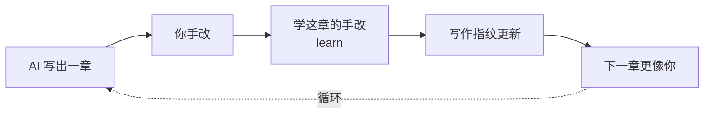
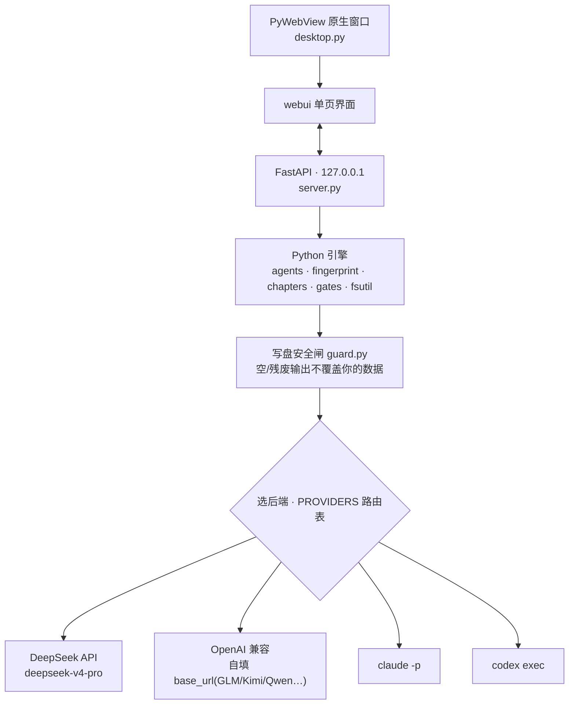

<div align="center">

<picture>
  <source media="(prefers-color-scheme: dark)" srcset="docs/design/loom-logo-dark.png" />
  
</picture>

# loom · 织布机

**把一队分工 Agent 织成一条写小说的流水线**,做成桌面客户端(Mac / Windows)。<br/>
读着你的「外置大脑」,一键跑出一章正文;你手改,它**越写越像你**。

[](LICENSE)
[](https://github.com/WadeZhao23/loom-novel/releases/latest)


[⬇ 下载最新版](https://github.com/WadeZhao23/loom-novel/releases/latest) · [它是什么](#它是什么) · [里面有什么](#里面有什么) · [跑起来](#跑起来) · [隐私](#隐私--数据去向) · [交流](#反馈--交流)

</div>

---

> 后端可插拔,九选一:**DeepSeek(默认)/ 智谱 GLM / Moonshot Kimi / 通义 Qwen / 豆包(火山方舟)/ 硅基流动**(国产直连、不用梯子、各家自带 key)/ **Claude Code / Codex**(复用本机客户端登录、免 key)/ **OpenAI 兼容(自填 base_url)**。设置里一键切换 + 检测连接;模型**可下拉可手填** + 「拉取可用模型」实时列真实型号(名字怎么变都不过时);DeepSeek 默认 `deepseek-v4-pro`。

## 它是什么

- **外置大脑**(每本书独有、会变):世界观 / 人物卡 / 卡章纲 / 立项卡 / 文风参考 / 状态账本 / **写作指纹** / 违禁词。可手填,也可 AI 一键铺底稿、就地改写续写。
- **skills**(跨书复用、不变):网文大神 / 去AI味 / 故事引擎 / 黄金开篇 / 评估自检 / 世界观引擎 / 金手指 / 拆书,外加 **38 个题材速查**(新建时按题材只拷一份给设定师)。
- **agents**(5 道工序):设定师 → 大纲师 → 写手 → 编辑 → 润色师。每个顶部 YAML 声明它读哪些文件。

### 一章,是这样织出来的


5 个 agent 顺序跑,累积一个「本章工作区」,每步读到目前为止的全部产物;写第 N 章还会读你手改后的第 N-1 章做衔接。

### 流水线上的五个人

|  |  |  |
|:--:|:--:|:--:|
|  |  |  |
| **设定师** · 立规矩 | **大纲师** · 搭骨架 | **写手** · 落字 |
| 守世界观,钉死硬约束 | 按字数预算定场次,标爆点 | 照你的写作指纹落字 |
|  |  |  |
| **编辑** · 挑硬伤 | **润色师** · 去AI味 |  |
| 盘爽点/钩子/OOC,当场改 | 擦机器腔,留你的口头禅 |  |

### 两条核心理念

- **写作指纹 = 像你**。写手/润色师照它写;你点「学这章的手改」,它把**你的改动**蒸馏进指纹,越写越像你。指纹只学你的改动,绝不学 AI 自己的输出。
- **去AI味 = 独立功能**,只擦通用机器味、让文字像真人——不针对任何检测器作弊。



## 里面有什么

- **不丢稿**:所有写盘原子化(断电/崩溃不截成半截),每章覆盖前留版本历史,删章进回收站可恢复;写章 / learn / 保存各有写锁,并发不写坏账本。
- **长篇不崩**:**脉络三视图**(时间轴 / 伏笔账本 / 专名册,全书只读投影);**跨章除虫闭环**——每章写完自动查五类跨章矛盾(物品复活 / 人设跌份 / 金手指规则数值漂 / 时间粒度 / 衔接冲突)+ **状态账本**逐章记状态;**硬设定逐字直送**(境界阶梯 / 金手指代价 / 地名势力 / 人物专名整段原文送大纲师和写手,不经转述走样);伏笔埋久没还会提醒。
- **越写越像你**:写作指纹只学你的手改、绝不学 AI 输出;去AI味两道本地检测(句内 AI 翻转句 + 跨章套路复用)先过你的 anchor 豁免再进关卡;可从欣赏的作者范文播种「起点」,但开局像他、终局收敛到你。
- **外置大脑目录化**:世界观一节一文件、人物一人一卡(文件名即专名);learn 的 AI 补充单独进「成长档案」,永不碰你手写的;「冰山真相」按文件名挡住不喂写手,防提前剧透。
- **字数尽量听话**:大纲师按目标字数定场次并给每场标字数,写手写满即收,编辑/润色拿到原稿实测字数、超了才压回来(合格稿不瞎压)、绝不扩写;改了目标字数后还用旧细纲会提醒你重生成。诚实说:AI 没法边写边精确数字数,单章仍有 ±25-30% 波动,那是模型天花板,想要某章精确手改最稳。
- **接入灵活 · 本地优先**:九选一后端(国产六家直连 / Claude·Codex 免 key / OpenAI 兼容自填 base_url),可下拉可手填、拉取真实型号;稿子只在你磁盘,Loom 无服务器、无遥测、无账号。

## 更新记录

> 公开版本从 **0.3.3** 起、以诚实的早期 0.x 重新计数。更早出现过的 1.x–3.x 是重置前的内部开发编号,已不再对应任何发布。

### 0.4.0 · 书房伙伴长本事
「伙伴」从一段段填表升级成能**对话**的领航员:读你这本书的现状,一次给几张**能直接点的候选卡**挑,挑定自动往下走,一路把平台题材、世界观、主角、章纲聊清楚。看得见它在干嘛(可展开的动作记录「看了地基 ▸」+ DeepSeek 思路实时灰字流「已思考 ▸」可回看)、回复中随时能**停**。建书不再逼选平台(挪进立项、可聊可跳)。候选卡拍板改叫「落库」、落完自动引下一格。

### 0.3.9 · 答题起书
新建一本书不再对着空模板发愣:左边「伙伴」面板一段段问你——平台题材、世界观、主角、前几章怎么走,每题给几个选项、也能自己写;你定的答案直接落进对应设定文件(和手写的一样)。顺手修了个 Windows 上书名带特殊字符建不了书的 bug。

### 0.3.8 · 品牌楷体随包
霞鹜文楷屏幕阅读版 GB2312 子集(1.7MB woff2,OFL)**随包分发**,logo / 弹窗标题 / 章题这些品牌时刻三端长一个样,不再看用户系统里装没装楷体。正文字体不变,子集外生僻字自动回退。

### 0.3.7 · 字数五螺丝
给字数控制拧上几颗确定性螺丝:编辑/润色**知道原稿实测多少字**、超出发布篇幅才带「超 X%」去压(合格稿不瞎压);改了目标字数还用**按旧字数拆的细纲**会提示重新生成;细纲没标字数会提醒;超长提醒更早(超 1.25 倍)、更显眼。诚实局限:单章仍有 ±25-30% 波动。

### 0.3.6 · 导入铺底
已经用别的工具攒了一堆设定 / 大纲 / 人物 / 章纲?**选个文件夹就接进来**,按文件名归位(大纲进卡章纲、人物进人物、设定进世界观),猜不出的让你指认。**原样不改一个字**(连全角缩进、空行都照留),GBK 旧稿也吃得下、不坏书。

### 0.3.5 · 除虫闭环
每章写完自动**除虫**:对照前几章 / 状态账本 / 设定,查五类跨章矛盾(物品复用 / 人设跌份 / 规则数值前后不一 / 时间词粒度 / 衔接冲突),报告带证据和可直接用的修改示例,点「按建议改」定位到段落预填行内改写。新增**状态账本**(脉络第四页签),每章自动记四类状态、AI 只追加不改你改过的。

### 0.3.4 · 书房 AI 协作
正文**随处可改**:鼠标移到某一行浮出「改」,就地展开小面板说一句怎么改,候选你定;选中一段浮出朱批条同理。世界观 / 人物也能 **AI 改写选中 / 续写**,候选确认才落盘,绝不碰你的写作指纹。

### 0.3.3 · 立项即铺底
专治「新建一本书,第一章却和书名对不上」:书名写进每道工序的提示词;建书填一句话设定就能 AI **一键铺** 世界观 / 人物 / 卡章纲底稿;出厂占位模板、空表单行不再冒充你的设定喂给模型。

## 拿到它

- **网文作者(不写代码)**:去 [Releases](https://github.com/WadeZhao23/loom-novel/releases/latest) 下载 `Loom-mac.zip` 或 `Loom-win.zip` → 解压 → **Mac 右键 → 打开**(未签名,首次需右键打开绕过「无法验证开发者」);**Windows** 双击,SmartScreen 蓝框时点「更多信息 → 仍要运行」。
- **开发者 / 从源码跑**:见下「跑起来」。

## 跑起来

```bash
pip install -e .          # 装好后有三个入口
loom-app                  # ① 桌面客户端(原生窗口)—— 推荐
loom-serve                # ② 兜底:在浏览器里跑(pywebview 出问题时用)
loom                      # ③ 内部引擎调试 CLI(开发用,非产品)
```

打开后:**新建一本书** → 顶栏选后端、填 DeepSeek API Key(`platform.deepseek.com` 申请)→ 外置大脑可**一键起草初稿**(或自己填)、左侧「喂样本」让它懂你的文风 → **写第 1 章**(看 5 个 agent 依次点亮;点写章会顺手存好后端)→ 在编辑器里手改 → **学这章的手改**(指纹更新,越来越像你)。

- 用 Claude Code / Codex 当后端时,顶栏切 provider 即可,**无需在 Loom 填 key**:Loom 直接 shell 到本机 `claude -p` / `codex exec`,复用它们各自客户端的登录(含订阅)。前提是已装好 `claude` / `codex` 命令并登录过(`codex login`)。

## 隐私 / 数据去向

Loom 没有服务器、没有遥测、没有账号——**Loom 自身不收集、不上传任何东西**。

- **你的书全在本地**:正文 / 外置大脑 / 写作指纹 / 版本历史 / 备份,都存在你磁盘上的项目文件夹里。
- **AI 生成会把上下文发给你选的模型**(任何 AI 写作工具都绕不开):写一章时,世界观 / 人物卡 / 卡章纲 / 写作指纹 / 上一章 + 你的指令会发给——
  - **DeepSeek**:DeepSeek 云端 API(用你自己的 key);
  - **Claude Code / Codex**:经你本机的 `claude` / `codex` 客户端 → Anthropic / OpenAI。

  Loom 只是把内容交给它们生成,不额外留存、不中转、不旁路上传。
- **key**:DeepSeek key 明文存在项目里的 `.env`——别把含 `.env` 的项目整包发别人;「备份整本」生成的 zip **不含 .env**,拷走是安全的。Claude / Codex 复用客户端登录,Loom 不碰它们的 key。

## 架构(为什么这么搭)

纯 Python 引擎(`loom/`:backends / agents / fingerprint / chapters / gates / fsutil)→ 本地 FastAPI(`server.py`,只听 127.0.0.1)→ Web 单页界面(`webui/`)→ PyWebView 套原生窗口(`desktop.py`)。引擎跨平台、与界面解耦(进度走事件回调),Windows 复用 ≈95%,只需重打包。详见 [docs/adr/0004](docs/adr/0004-desktop-client-pywebview.md)。



## 设计记录

词表见 [CONTEXT.md](CONTEXT.md),关键决定见 [docs/adr/](docs/adr/)(指纹为什么是活的、为什么只学你的改动、为什么不绑检测分数、为什么做成桌面端)。

## 反馈 · 交流

Loom 还在早期,写得不够好的地方欢迎直说。有问题、想反馈,或想聊聊网文 + AI 写作——加微信 **yuzhao923**(备注 Loom)。

## License & 素材

[MIT](LICENSE) © 2026 Chambers

agent 角色头像由 [ModelScope](https://modelscope.cn) 的 Qwen-Image 生成,随本仓库一并以 MIT 分发。
