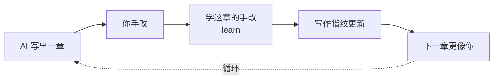
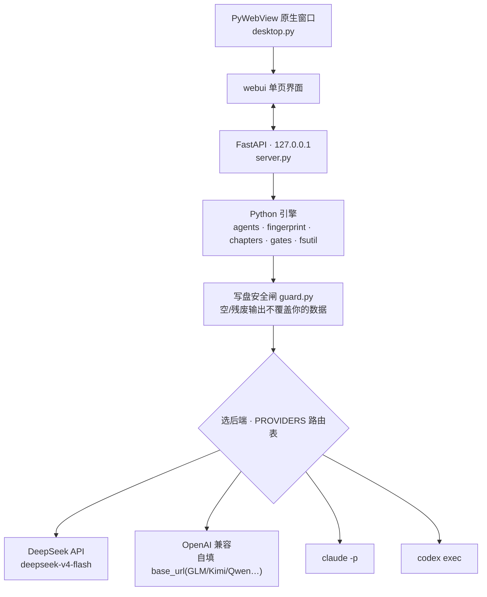

<div align="center">


# loom · 织布机

**把一队分工 Agent 织成一条写小说的流水线**,做成桌面客户端(Mac / Windows)。<br/>
读着你的「外置大脑」,一键跑出一章正文;你手改,它**越写越像你**。

[](LICENSE)
[](https://github.com/WadeZhao23/loom-novel/releases/latest)


[⬇ 下载最新版](https://github.com/WadeZhao23/loom-novel/releases/latest) · [它是什么](#它是什么) · [跑起来](#跑起来) · [隐私](#隐私--数据去向)

</div>

---

> 后端可插拔:DeepSeek(国产、不用梯子,自带 key)/ Claude Code / Codex(复用客户端登录、免 key)/ **OpenAI 兼容(自定义 base_url,接智谱GLM/Moonshot/Qwen/硅基流动等)**,界面里一键切换 + 检测连接。模型是**可下拉可手填** + 「拉取可用模型」实时列当前真实可用的型号(名字怎么变都不过时);DeepSeek 默认 `deepseek-v4-flash`。

## 它是什么

- **外置大脑**(每本书独有、会变):世界观 / 人物卡 / 卡章纲 / **写作指纹** / 违禁词。
- **skills**(跨书复用、不变):网文大神 / 去AI味 / 故事引擎 / 黄金开篇 / 评估自检 / 世界观引擎 / 金手指 / 拆书,外加 **37 个题材速查**(新建时按题材只拷一份给设定师)。
- **agents**(5 道工序):设定师 → 大纲师 → 写手 → 编辑 → 润色师。每个顶部 YAML 声明它读哪些文件。

### 一章,是这样织出来的


5 个 agent 顺序跑,累积一个「本章工作区」,每步读到目前为止的全部产物;写第 N 章还会读你手改后的第 N-1 章做衔接。

### 流水线上的五个人

|  |  |  |
|:--:|:--:|:--:|
|  |  |  |
| **设定师** · 立规矩 | **大纲师** · 搭骨架 | **写手** · 落字 |
| 守世界观,钉死硬约束 | 拆 3–6 场分镜,标爆点 | 照你的写作指纹落字 |
|  |  |  |
| **编辑** · 挑硬伤 | **润色师** · 去AI味 |  |
| 盘爽点/钩子/OOC,当场改 | 擦机器腔,留你的口头禅 |  |

### 两条核心理念

- **写作指纹 = 像你**。写手/润色师照它写;你点「学这章的手改」,它把**你的改动**蒸馏进指纹,越写越像你。指纹只学你的改动,绝不学 AI 自己的输出。
- **去AI味 = 独立功能**,只擦通用机器味、让文字像真人——不针对任何检测器作弊。



### 1.3 新增

- **多供应商模型路由**:除 DeepSeek / Claude / Codex 外,新增「OpenAI 兼容(自定义)」——自填 base_url + key,接智谱GLM / Moonshot / 通义Qwen / 硅基流动等任意 OpenAI 兼容供应商。模型框改成**可下拉可手填** + 「拉取可用模型」实时拉当前真实可用的型号(模型改名不再过时);DeepSeek 默认升到 `deepseek-v4-flash`(旧名 `deepseek-chat/reasoner` 7/24 停用)。填错模型(如把 `v4-flash` 当 DeepSeek 名)会**软提示**、不阻断。
- **再也不会「换模型把指纹学空」**:模型这次返回空 / 残废,Loom **宁可不写、明确报错,也绝不拿空内容覆盖**你攒下的写作指纹 / 正文;指纹明显被磨短还会提示「可一键撤销」。(根治一例用户实报的数据丢失。)
- **每章带标题**:写完一章 AI 自动起个标题、落进正文首行,侧栏直接显示;随时改首行改名。改标题不会被当文风学进指纹、也不触发「手改过」。

### 1.1 / 1.2 新增

- **外置大脑一键起草初稿**:不想对着空模板发呆?写一句故事设定,AI 据书名 + 题材起草 世界观 / 人物卡 / 卡章纲 三件套,你再改成自己的(只填空白 / 占位,绝不动你已写的)。
- **外置大脑随章生长**:`learn` 一章后,从你的定稿里把这章新冒出来的设定 / 人物以 `[AI补充]` 块追加进世界观 / 人物卡(只追加、绝不覆盖你手写的)。
- **细纲可看可改**:大纲师的分镜细纲落盘可编辑——改它,重写本章就按你的骨架来;想换方案点「重新生成细纲」。
- **Markdown 渲染预览**:外置大脑 / skills / agents 默认渲染好看,不再一脸 `#` 和 `-`;「预览 / 编辑」一键切换。
- **写章即存后端**:点「写第 N 章」自动保存当前后端配置,不必再先单独点「保存后端」。
- **写作指纹更稳**:`learn` 改累积式——只增不删,不再因换模型重蒸馏抹掉你攒下的文风;弹窗把「删除」标红,误删一键撤销。

### 1.0 新增

- **不丢稿**:所有写盘原子化(断电/崩溃不会把正文截成空或半截);每章覆盖前自动留版本历史,误删误覆盖一键回滚。
- **章节管理**:侧栏每章可删 / 插空章 / 上下移,关联产物自动安全重排,删除进回收站可恢复。
- **角色化的 5 道工序**:每个 agent 有形象 + 一句话人设,点开看整条流水线怎么织出一章(不再糊一脸提示词)。
- **违禁词自检**:按国内平台常见雷区本地粗筛 + 改写指引,只提示不阻断。
- **后端一键连**:Claude / Codex 不用填 key,点「检测连接」确认就绪;首跑没配 key 会拦住空跑。
- 全套图标重做、明暗主题、新手引导。

<details>
<summary>更早的演进(v0.2 / v0.1)</summary>

在 v0.1 原型上做的增量,只取「合 Loom 极简 / 像你」的部分(拒绝向量库 / 打分 / 投影等重基础设施):

- **写后摘要补卡章纲**:`learn` 一章后,从你的手改终稿自动抽 ≤150 字摘要 + 伏笔三态,write-once 回填卡章纲的 `[AI回顾]` 子块,补跨章记忆短板。可手改,绝不回流写作指纹。
- **断点续跑**:写章中途断网/报错不再白跑前几步;上游(设定/卡章纲/上一章)没变的工序跳过,省 DeepSeek 计费。
- **题材库 / 金手指卡 / 拆书**:设定层的内容补给,只进设定师/世界观(管 what),绝不喂写手/写作指纹(管 voice)。
- **审稿留痕**:编辑就地改好之余,附《本章改动留痕》到盘外 `.审稿留痕/`,留痕绝不进终稿/快照(不污染 learn)。
- **启动自检 `loom doctor`**:缺 key/依赖/命令时,一眼看清「缺什么 → 怎么补」。
- **流式生成 + learn 可撤销**:DeepSeek 边写边出;`learn` 后看清「这次学到了什么」,学歪了一键撤销。
- **备份 + 导出**(纯本地):导出 txt、整本打包 zip 备份(不含密钥)。

</details>

## 拿到它

- **网文作者(不写代码)**:去 [Releases](https://github.com/WadeZhao23/loom-novel/releases/latest) 下载 `Loom-mac.zip` 或 `Loom-win.zip` → 解压 → **Mac 右键 → 打开**(未签名,首次需右键打开绕过「无法验证开发者」);**Windows** 双击,SmartScreen 蓝框时点「更多信息 → 仍要运行」。
- **开发者 / 从源码跑**:见下「跑起来」。

## 跑起来

```bash
pip install -e .          # 装好后有三个入口
loom-app                  # ① 桌面客户端(原生窗口)—— 推荐
loom-serve                # ② 兜底:在浏览器里跑(pywebview 出问题时用)
loom                      # ③ 内部引擎调试 CLI(开发用,非产品)
```

打开后:**新建一本书** → 顶栏选后端、填 DeepSeek API Key(`platform.deepseek.com` 申请)→ 外置大脑可**一键起草初稿**(或自己填)、左侧「喂样本」让它懂你的文风 → **写第 1 章**(看 5 个 agent 依次点亮;点写章会顺手存好后端)→ 在编辑器里手改 → **学这章的手改**(指纹更新,越来越像你)。

- 用 Claude Code / Codex 当后端时,顶栏切 provider 即可,**无需在 Loom 填 key**:Loom 直接 shell 到本机 `claude -p` / `codex exec`,复用它们各自客户端的登录(含订阅)。前提是已装好 `claude` / `codex` 命令并登录过(`codex login`)。

## 隐私 / 数据去向

Loom 没有服务器、没有遥测、没有账号——**Loom 自身不收集、不上传任何东西**。

- **你的书全在本地**:正文 / 外置大脑 / 写作指纹 / 版本历史 / 备份,都存在你磁盘上的项目文件夹里。
- **AI 生成会把上下文发给你选的模型**(任何 AI 写作工具都绕不开):写一章时,世界观 / 人物卡 / 卡章纲 / 写作指纹 / 上一章 + 你的指令会发给——
  - **DeepSeek**:DeepSeek 云端 API(用你自己的 key);
  - **Claude Code / Codex**:经你本机的 `claude` / `codex` 客户端 → Anthropic / OpenAI。

  Loom 只是把内容交给它们生成,不额外留存、不中转、不旁路上传。
- **key**:DeepSeek key 明文存在项目里的 `.env`——别把含 `.env` 的项目整包发别人;「备份整本」生成的 zip **不含 .env**,拷走是安全的。Claude / Codex 复用客户端登录,Loom 不碰它们的 key。

## 架构(为什么这么搭)

纯 Python 引擎(`loom/`:backends / agents / fingerprint / chapters / gates / fsutil)→ 本地 FastAPI(`server.py`,只听 127.0.0.1)→ Web 单页界面(`webui/`)→ PyWebView 套原生窗口(`desktop.py`)。引擎跨平台、与界面解耦(进度走事件回调),Windows 复用 ≈95%,只需重打包。详见 [docs/adr/0004](docs/adr/0004-desktop-client-pywebview.md)。



## 设计记录

词表见 [CONTEXT.md](CONTEXT.md),关键决定见 [docs/adr/](docs/adr/)(指纹为什么是活的、为什么只学你的改动、为什么不绑检测分数、为什么做成桌面端)。

## License & 素材

[MIT](LICENSE) © 2026 Chambers

agent 角色头像由 [ModelScope](https://modelscope.cn) 的 Qwen-Image 生成,随本仓库一并以 MIT 分发。
